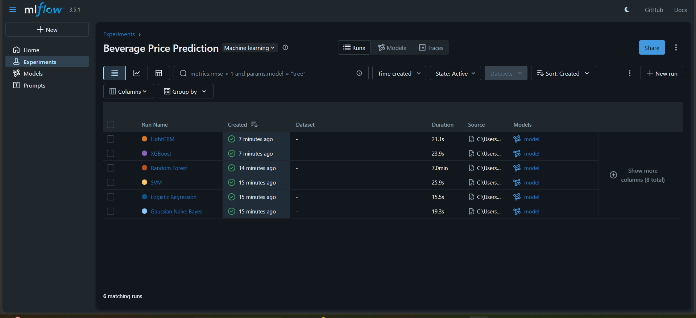
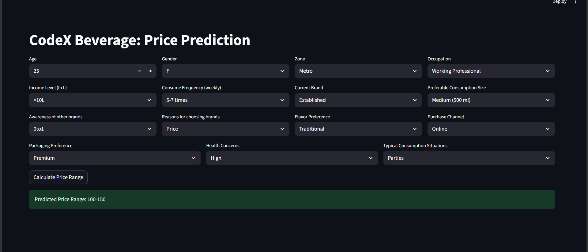

# Beverage Price Range Prediction System

## Project Overview

This project is an end-to-end Machine Learning application that predicts the preferred beverage price range of customers based on demographic, behavioral, and brand-related factors.

The project includes:

- Data Cleaning & Preprocessing
- Feature Engineering
- Model Training & Comparison
- MLflow Experiment Tracking
- Model Versioning with DagsHub
- Streamlit Web Application Deployment

---

## Problem Statement

The goal of this project is to predict a customer's preferred beverage price range using survey and behavioral data.

### Target Variable
"price_range"

### Price Categories

- 50-100
- 100-150
- 150-200
- 200-250

---

## Dataset Features

Some important features used:

- Age Group
- Gender
- Zone
- Income Levels
- Current Brand
- Consumption Frequency
- Health Concerns
- Awareness of Other Brands
- Reasons for Choosing Brands
- Preferred Consumption Size

---

## Data Preprocessing

### Data Cleaning

- Removed inconsistencies
- Handled missing values
- Checked duplicates
- Standardized categorical values

### Feature Engineering

Created custom features such as:

- CF_AB Score
- ZAS Score
- Brand Switching Index (BSI)

---

## Encoding Techniques Used

### Label Encoding

Applied on:

- age_group
- income_levels
- health_concerns
- consume_frequency(weekly)
- preferable_consumption_size

### One Hot Encoding

Applied using pandas `get_dummies()`.

---

## Machine Learning Models Used

The following models were trained and compared:

- Logistic Regression
- Gaussian Naive Bayes
- Support Vector Machine (SVM)
- Random Forest
- XGBoost
- LightGBM

---

## Model Evaluation

### Evaluation Metrics

- Accuracy Score
- Confusion Matrix
- Classification Report

### Best Model Accuracy

`0.92`

The model performed especially well in distinguishing broader price ranges, while minor confusion existed between neighboring ranges such as:

- 150-200
- 200-250

This is expected behavior in multiclass classification problems.

---

## MLflow Tracking

MLflow was used for:

- Logging experiments
- Tracking parameters
- Comparing models
- Monitoring metrics

---

## DagsHub Integration

DagsHub was used for:

- Model versioning
- Experiment collaboration
- Remote ML tracking

---

## Streamlit Application

A Streamlit web app was developed for real-time prediction.

Users can:

- Enter demographic details
- Select behavioral preferences
- Predict beverage price range instantly

---

## Tech Stack

### Programming Language

- Python

### Libraries Used

- Pandas
- NumPy
- Scikit-learn
- XGBoost
- LightGBM
- Streamlit
- MLflow
- Joblib

---

## Project Structure

    codex_ml_project/
    │
    ├── images/
    │   ├── dagshub_tracking.png
    │   └── streamlit_app.png
    │
    ├── app.py
    ├── main.py
    ├── best_model.pkl
    ├── training_columns.pkl
    ├── requirements.txt
    └── README.md

---

## Installation

Clone repository:

    git clone YOUR_REPOSITORY_LINK

Install dependencies:

    pip install -r requirements.txt

Run Streamlit app:

    python -m streamlit run app.py

---

## Future Improvements

- Hyperparameter tuning
- Probability-based prediction confidence
- Improved feature engineering
- Deployment using Docker/AWS
- Real-time database integration

---

## Key Learning

Through this project, I realized that building models alone is not enough — deriving meaningful business insights and deploying usable ML applications is equally important.

This project helped me understand:

- End-to-end ML workflow
- Experiment tracking
- Model deployment
- Real-world preprocessing challenges
- UI integration with ML systems

---

## Author

Anuja Nagrikar

